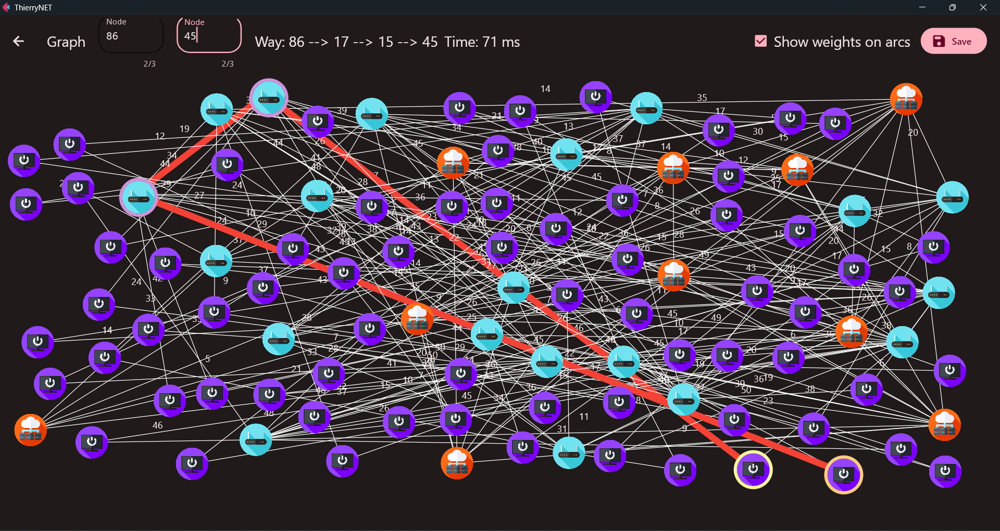

# Tables de Routage - Projet Universitaire




## Membres de l'Équipe

- ARIAS Joseph, 22200738
- BOISSERIE Baptiste, 22200450
- BORGES Arthur, 22200432
- FRANÇOIS Alexandre, 22201695

## Description du Projet

Ce projet est réalisé dans le cadre du cours "IN403 - Algorithmique de Graphes" à l'Université de Versailles - Saint-Quentin-en-Yvelines. L'objectif est de développer une application capable d'établir la table de routage de chaque nœud dans un réseau de 100 nœuds. Nous utiliserons des concepts tels que le transit IP, le backbone, les niveaux d'opérateurs (Tier), et le peering pour modéliser notre réseau. Ce travail nécessite une compréhension approfondie des réseaux informatiques et une bonne dose d'humour pour naviguer à travers les complexités de la connectivité.

Dans le vaste océan des réseaux informatiques, où les données naviguent telles des navires intrépides, se trouve notre projet, une île d'innovation (pas sur de ça ^^). Au cœur de cette aventure se trouve le **transit IP**, un service de guide touristique pour nos paquets de données, les escortant à travers les méandres du réseau mondial, d'un point A à un point B, sans jamais demander un pourboire.

Au centre de notre île se dresse le **backbone**, l'épine dorsale de notre réseau. Imaginez-le comme l'autoroute principale de notre île, où les données filent à la vitesse de la lumière, évitant les embouteillages des petites routes de campagne. C'est le super-héros des autoroutes, toujours là pour assurer un trafic fluide et rapide.

Puis, il y a les **niveaux d'opérateurs**, ou les Tiers, les différentes classes de notre école de réseau. Le Tier 1, c'est le grand frère, celui qui a des connexions partout et qui ne connaît aucune limite. Les Tiers 2 et 3, ce sont les cadets, qui s'appuient sur le grand frère pour atteindre des contrées lointaines. Ensemble, ils forment une famille unie (ce que je n'ai pas...), veillant à ce que chaque paquet de données trouve son chemin vers la maison.

Et enfin, le **peering**, ce moment magique où deux réseaux se donnent la main et décident de partager leurs chemins, comme deux vieux amis qui se retrouvent pour échanger les dernières nouvelles. C'est l'entraide dans toute sa splendeur, un petit monde où tout le monde gagne à être connecté (667).

Mais attendez, il y a plus ! Plongeons dans le glossaire de notre île technologique pour découvrir quelques perles de sagesse d'un vieux chauve :

- **Table de routage** : Le carnet d'adresses secret de chaque routeur, où il garde une liste de qui habite où dans le vaste monde du réseau, pour s'assurer que chaque paquet de données trouve son chemin vers la maison, sans se perdre dans les ruelles sombres d'Internet.
- **Nœud** : Chaque habitant de notre île, des plus petits gadgets aux géants de la technologie. Chacun a sa propre histoire, sa propre adresse, et bien sûr, sa propre contribution au grand livre des potins du réseau.
- **Topologie réseau** : La carte au trésor de notre île, montrant qui est connecté à qui, par quels tunnels secrets et ponts suspendus. Un véritable casse-tête pour les architectes en herbe !
- **Connectivité du réseau** : Un peu comme les rumeurs dans un petit village, la connectivité vérifie si l'information (ou les potins) peut se propager de porte en porte sans rencontrer de porte fermée.
- **Algorithme de routage** : Le sage du village, celui qui connaît tous les chemins, raccourcis et passages secrets pour aller d'un point A à un point B. Un véritable maître de la navigation qui murmure à l'oreille des routeurs.
- **Interface utilisateur** : La fenêtre magique à travers laquelle nous, simples mortels, pouvons jeter un coup d'œil et interagir avec le monde mystérieux des données en mouvement. Un spectacle fascinant, surtout lorsque les données exécutent leur ballet synchronisé à la perfection.

Avec un peu de code, beaucoup d'imagination et une pincée d'humour, nous faisons danser les paquets de données au rythme de nos algorithmes. Bienvenue dans notre aventure !

## Objectifs

- Création d'une topologie réseau réaliste de 100 nœuds.
- Vérification de la connectivité du réseau.
- Détermination des tables de routage pour chaque nœud.
- Développement d'une interface utilisateur pour visualiser les chemins de routage.

## Technologies Utilisées

- **Langage de programmation :** Python 3.11
- **IDE :** PyCharm
- **Bibliothèques principales :** Flet (version 0.21.2) - la liste complète des bibliothèques se trouve dans le fichier `requirements.txt`.

## Architecture du Programme

Le programme est conçu avec une architecture modulaire, chaque module ayant une responsabilité spécifique pour faciliter la maintenance et l'extensibilité.

- **`graph.py` : Implémentation des Graphes**
  - Sert de fondation pour la représentation des graphes.
  - Offre des classes pour les sommets (`Vertex`), les arêtes (`Edge`), et la structure globale du graphe (`Graph`).
  - Permet la manipulation des éléments du graphe et la navigation à travers les voisins des sommets.

- **`graph_creation.py` : Génération de Graphes**
  - Définit une méthode pour générer des graphes avec une structure hiérarchique basée sur des "tiers".
  - Les sommets sont répartis en niveaux, avec des règles spécifiques pour la création d'arêtes entre eux.

- **`path_finding.py` : Recherche de Chemins**
  - Contient une implémentation de l'algorithme de Dijkstra pour trouver les chemins les plus courts dans un graphe pondéré.
  - Essentiel pour calculer les itinéraires optimaux et pour la construction des tables de routage.

- **`interface.py` : Interface Utilisateur**
  - Utilise la bibliothèque Flet pour créer une interface graphique utilisateur interactive.
  - Permet la visualisation du graphe, la sélection des sommets, et la visualisation des chemins entre eux.

- **`main.py` : Point d'Entrée**
  - Orchestre l'interaction entre les autres modules.
  - Initialise le graphe, configure l'interface utilisateur et gère les interactions utilisateur.

- **`depth_first_search.py` : Recherche en Profondeur**
  - Implémente l'algorithme de recherche en profondeur pour explorer le graphe.
  - Utilisé pour vérifier la connectivité du réseau et pour découvrir les composantes connexes.

- **`priority_queue.py` : File de Priorité**
  - Définit une structure de file de priorité utilisée dans l'algorithme de Dijkstra.
  - Organise les éléments selon leur priorité pour optimiser la recherche de chemin.

- **`routing_table.py` : Tables de Routage**
  - Responsable de la construction des tables de routage pour chaque sommet du graphe.
  - Utilise l'algorithme de Dijkstra pour déterminer les chemins les plus courts et facilite la récupération des itinéraires optimaux.

Cette structure en points clarifie la fonction et l'objectif de chaque module au sein du programme, soulignant leur contribution individuelle au système global.

## Interface Utilisateur (`interface.py`)

Le fichier `interface.py` exploite la bibliothèque Flet pour créer une interface graphique utilisateur permettant la visualisation et l'interaction avec des graphes.

### Page d'accueil

L'application démarre sur une page d'accueil affichant un logo, accessible depuis `assets/logo.png`. Cette interface initiale inclut un bouton "Get started with new graph" qui, lorsqu'il est cliqué, génère un nouveau graphique de manière aléatoire. Les utilisateurs ont également la possibilité de charger un graphe préalablement sauvegardé.

### Interaction avec le graphe

Les utilisateurs peuvent interagir avec le graphe de plusieurs manières :
- **Génération d'un nouveau graphe :** Chaque clic sur "Get started with new graph" génère un nouveau graphe.
- **Chargement et sauvegarde de graphes :** Les graphes peuvent être sauvegardés et chargés, permettant une reprise facile des sessions précédentes.
- **Manipulation des nœuds :** Il est possible de déplacer les nœuds sur l'interface. Un clic sur un nœud permet d'afficher le chemin le plus court depuis ce nœud jusqu'à un autre avec son poids. On peut aussi passer la souris dessus pour afficher le Tier du nœud et son identifiant. Nous pouvons aussi rentrer au clavier le noeud de départ et d'arrivée pour afficher le chemin le plus court.
- **Sauvegarder le graphe :** Les utilisateurs peuvent sauvegarder l'état actuel du graphe pour une utilisation future.
- **Affichage du poids des arêtes :** Les arêtes affichent leur poids, permettant une visualisation claire des connexions entre les nœuds mais nous pouvons aussi les cacher.

## Génération de Graphes (`graph_creation.py`)

Le fichier `graph_creation.py` introduit une méthode systématique pour générer des graphes structurés, en répartissant les sommets en plusieurs "tiers" et en établissant des arêtes entre eux selon des règles définies.

### Fonction `create_graph`

- **Objectif** : Construire un graphe structuré avec une répartition hiérarchique des sommets et des règles prédéfinies pour la création d'arêtes.
- **Tiers des sommets** :
  - **Tier 1** (Backbone) : Constitue la base du graphe avec 10 sommets centraux.
  - **Tier 2** : Forme un niveau intermédiaire avec 20 sommets.
  - **Tier 3** : Comprend 70 sommets formant la couche la plus externe ou la périphérie du graphe.
- **Création d'arêtes** :
  - Arêtes intra-Tier 1 : Connectent les sommets du backbone entre eux, sans doublons, avec des poids aléatoires.
  - Arêtes intra-Tier 2 : Assurent une connectivité minimale entre les sommets du Tier 2, suivant des critères spécifiques et des poids aléatoires.
  - Arêtes inter-Tiers (1-2 et 2-3) : Établissent des liens entre les niveaux, respectant certaines conditions pour maintenir la structure hiérarchique du graphe, avec des poids aléatoires.

Cette méthode de génération de graphe offre un moyen de créer des structures de données complexes simulant des réseaux réels, où la connectivité varie significativement entre différents niveaux ou groupes au sein du réseau. La distinction en "tiers" permet de modéliser divers scénarios de réseaux et d'analyser l'impact de la structure sur la diffusion d'informations, la résilience du réseau et d'autres caractéristiques clés.

## Recherche de Chemins (`path_finding.py`)

Le fichier `path_finding.py` intègre une fonction clé de recherche de chemin dans le graphe, s'appuyant sur une adaptation de l'algorithme de Dijkstra pour calculer les chemins les plus courts depuis un sommet donné vers tous les autres sommets d'un graphe pondéré.

### Fonction `pch`

- **Objectif** : Calculer les chemins les plus courts et les coûts associés depuis un sommet de départ dans un graphe pondéré, en utilisant l'algorithme de Dijkstra.
- **Paramètres** :
  - `graph` : Le graphe à explorer, doit être une instance de la classe `Graph`.
  - `start` : L'identifiant du sommet de départ.
- **Retourne** : Un dictionnaire contenant pour chaque sommet (identifié par sa clé) un tuple du coût total pour y parvenir depuis le sommet de départ et la liste des sommets constituant le chemin optimal.
- **Fonctionnement** :
  - Initialise une file de priorité pour gérer les sommets à explorer, en commençant par le sommet de départ avec un coût de `0`.
  - Utilise un dictionnaire `distances` pour suivre le coût le plus faible et le chemin associé pour chaque sommet.
  - Explore de manière itérative les sommets et leurs voisins, mettant à jour les coûts et les chemins dans `distances` chaque fois qu'un chemin moins coûteux est découvert.
  - Continue jusqu'à ce que tous les sommets accessibles aient été explorés et que les chemins les plus courts soient établis.

Cette implémentation offre une méthode efficace pour la résolution de problèmes de routage et de navigation dans des graphes pondérés, permettant de trouver de manière optimale les itinéraires à travers le graphe.

## Tables de Routage (`routing_table.py`)

Le fichier `routing_table.py` développe une fonctionnalité essentielle pour la construction de tables de routage au sein d'un graphe, en s'appuyant sur une variante de l'algorithme de Dijkstra pour déterminer le chemin le plus court entre les sommets.

### Fonction `create_routing_table`

- **Objectif** : Construire une table de routage pour chaque sommet dans un graphe, indiquant le premier sommet vers lequel se diriger pour atteindre n'importe quelle autre destination de manière optimale.
- **Paramètres** :
  - `graph` : Le graphe pour lequel la table de routage doit être construite.
- **Retourne** : Une structure de données complexe (liste de listes) où chaque sous-liste représente la table de routage pour un sommet donné du graphe.
- **Fonctionnement** :
  - Itère sur chaque sommet du graphe, calculant les chemins les plus courts vers tous les autres sommets.
  - Pour chaque destination, enregistre le premier sommet du chemin le plus court dans la table de routage du sommet source.
  - La table de routage finale permet une récupération rapide des itinéraires optimaux, essentielle pour les applications nécessitant des consultations fréquentes des chemins entre les sommets.

Cette approche optimise l'efficacité des opérations de recherche de chemin, en réduisant considérablement le temps nécessaire pour déterminer le prochain sommet à suivre dans le chemin le plus court d'un point A à un point B dans le graphe.

## Recherche en Profondeur (`depth_first_search.py`)

Le fichier `depth_first_search.py` met en œuvre l'algorithme de recherche en profondeur (DFS), un pilier de l'exploration de graphes. L'algorithme DFS est utilisé pour parcourir ou rechercher les structures de graphe, explorant aussi loin que possible le long de chaque branche avant de revenir.

### Fonction `explore_vertex`

- **Objectif** : Explorer de manière récursive un sommet et tous les sommets accessibles à partir de celui-ci.
- **Paramètres** :
  - `graph` : Le graphe contenant le sommet.
  - `vertex` : L'identifiant du sommet à explorer.
  - `visited_vertices` : Un ensemble des identifiants de sommets déjà visités.
- **Fonctionnement** : Ajoute le sommet courant à l'ensemble des visités et explore récursivement tous ses voisins non visités.

### Fonction `dfs_traversal`

- **Objectif** : Effectuer un parcours en profondeur du graphe entier pour vérifier sa connectivité.
- **Paramètres** :
  - `graph` : Le graphe à parcourir.
- **Retourne** : Booléen indiquant si le graphe est entièrement connecté (tous les sommets sont accessibles à partir de n'importe quel sommet).
- **Fonctionnement** : Initialise un ensemble de sommets visités et explore chaque sommet du graphe. Si, après l'exploration de tous les sommets accessibles à partir d'un point de départ, certains sommets restent non visités, cela indique que le graphe n'est pas entièrement connecté.

L'implémentation de DFS dans ce programme permet une exploration complète et systématique des graphes, offrant des insights essentiels sur leur structure et leur connectivité.

## Implémentation des Graphes (`graph.py`)

Le fichier `graph.py` constitue le cœur du système de représentation des graphes dans le programme, fournissant les structures de données nécessaires pour représenter les sommets, les arêtes, et la structure globale du graphe.

### Classe `Tiers`

Cette classe utilise l'énumération pour définir différents niveaux ou catégories pour les sommets du graphe, tels que `TIER1`, `TIER2`, et `TIER3`. Cette distinction peut être utilisée pour appliquer des logiques ou des poids spécifiques à différentes catégories de sommets, influençant ainsi le comportement des algorithmes appliqués au graphe.

### Classe `Edge`

Représente une arête dans le graphe, caractérisée par ses deux sommets terminaux (`vertex1` et `vertex2`) et un poids (`weight`). Cette structure est essentielle pour les graphes pondérés où les arêtes ont des valeurs associées représentant des coûts, des distances ou d'autres métriques significatives. La méthode `__repr__` fournit une représentation textuelle utile pour le débogage et l'affichage des informations de l'arête.

### Classe `Neighbour`

Capture la relation de voisinage entre les sommets, avec chaque instance représentant un voisin (`vertex`) et le poids de l'arête les reliant (`weight`). Cette abstraction facilite l'accès aux informations de voisinage d'un sommet, permettant des itérations efficaces à travers les sommets adjacents lors de l'exploration du graphe.

### Classe `Vertex`

Chaque sommet du graphe est une instance de `Vertex`, possédant une liste d'arêtes (`edges`), un identifiant unique (`identifier`), et un `tier`. La méthode `get_neighbours` renvoie la liste des voisins du sommet, extraites à partir de ses arêtes connectées, ce qui est crucial pour naviguer dans le graphe et implémenter des algorithmes de recherche de chemin, entre autres.

### Classe `Graph`

La structure globale du graphe est gérée par la classe `Graph`, qui maintient des listes de tous les sommets (`_vertices`) et de toutes les arêtes (`_edges`). Elle fournit des méthodes pour ajouter des sommets (`add_vertex`) et des arêtes (`add_edge`), ainsi que pour charger et sauvegarder l'état du graphe à partir de fichiers. La représentation textuelle fournie par `__repr__` donne un aperçu rapide du nombre de sommets et d'arêtes, facilitant ainsi la compréhension de la structure du graphe.

Cette implémentation détaillée offre une base robuste pour la manipulation de graphes, permettant la modélisation précise et flexible de divers scénarios et problèmes algorithmiques.


## File de Priorité (`priority_queue.py`)

La file de priorité, implémentée dans `priority_queue.py`, est une structure de données essentielle qui organise ses éléments en fonction de leur priorité, garantissant que l'élément avec la priorité la plus haute (ou la plus basse, selon la conception) est toujours traité en premier. Cette structure est particulièrement importante dans les algorithmes de recherche de chemin, comme Dijkstra, où la sélection du prochain sommet à explorer se base sur la distance la plus courte accumulée depuis le point de départ.

### Structure `QueueItem`

- **Rôle** : Représente les éléments individuels stockés dans la file. Chaque `QueueItem` contient une donnée (`item`) et un niveau de priorité (`priority`).
- **Fonctionnalités** :
  - `get_item()` : Retourne la donnée stockée dans l'élément.
  - `get_priority()` : Fournit la priorité de l'élément, déterminant sa position dans la file.
  - Les méthodes magiques `__lt__` et `__eq__` permettent la comparaison entre les éléments, essentielles pour maintenir l'ordre au sein de la file.

### Structure `Queue`

- **Rôle** : Représente la file de priorité elle-même, contenant et gérant les `QueueItem`.
- **Fonctionnalités Principales** :
  - `add(item: QueueItem)` : Ajoute un nouvel élément à la file, en respectant l'ordre de priorité.
  - `pop()` : Retire et retourne l'élément de plus haute priorité de la file, ce qui est souvent l'étape clé dans les algorithmes qui utilisent la file de priorité.
  - `__len__()` et `get(i: int)` : Fournissent respectivement la taille de la file et l'accès à un élément par son indice, sans le retirer de la file.

L'implémentation de la file de priorité dans le programme est un exemple clair de la façon dont des structures de données avancées peuvent être utilisées pour optimiser les performances des algorithmes, en assurant que les opérations critiques, comme la recherche du chemin le plus court, sont réalisées de manière efficace et ordonnée.

## Conclusion

Au terme de cette aventure académique, nous avons navigué à travers les vagues complexes des réseaux informatiques, armés de Python et d'une carte au trésor algorithmique. Le projet "Tables de Routage" s'est avéré être une île d'innovation et d'apprentissage, où chaque membre de l'équipe a contribué à l'élaboration d'une application capable de démystifier la navigation des données à travers un réseau de 100 nœuds.

Les concepts de transit IP, backbone, niveaux d'opérateurs (Tier) et peering ont été les piliers de notre construction réseau, nous permettant de modéliser un environnement réaliste tout en explorant la beauté sous-jacente des algorithmes de graphes. L'utilisation de Python, complétée par la bibliothèque Flet, nous a non seulement permis de développer une interface utilisateur intuitive mais aussi de visualiser de manière interactive les chemins de routage qui se tissaient entre les nœuds de notre réseau.

Chaque module de notre architecture logicielle, de la création des graphes à la recherche de chemins, en passant par les tables de routage et l'interface utilisateur, a été une pièce cruciale du puzzle, s'imbriquant parfaitement pour former un système complet et fonctionnel. L'algorithme de Dijkstra, en particulier, a été notre boussole, guidant les paquets de données à travers le labyrinthe de notre réseau avec une précision et une efficacité remarquables.

Alors que nous levons l'ancre de cette île d'innovation, nous emportons avec nous non seulement les connaissances et les compétences acquises, mais aussi les souvenirs d'une aventure partagée. Ce projet sera un phare, illuminant notre chemin vers de futurs défis et découvertes dans le vaste monde de l'informatique et des réseaux.


## Installation
Téléchargez la dernière release [ici](https://github.com/Liklenb/ThierryNET/releases)

## Build

Pour installer et exécuter l'application, suivez ces étapes :

1. **Cloner le projet :**
   ```bash
   git clone https://github.com/Liklenb/ThierryNET.git
   ```
2. **Accéder au répertoire du projet :**
   ```bash
    cd ThierryNET
    ```
3. **Installer les dépendances :** Utilisez `pip` pour installer les dépendances nécessaires. Actuellement, le projet dépend principalement de la bibliothèque `flet`.
   ```bash
   pip install flet==0.21.2
    ```
4. **Exécuter le script d'installation (pour linux uniquement) :** Exécutez le script `linux_install.sh`
    ```bash
   sudo ./linux_install.sh
   ```
5. **Exécuter le programme :** Lancez le programme en exécutant le fichier `main.py`.
    ```bash
    python main.py
    ```
   
